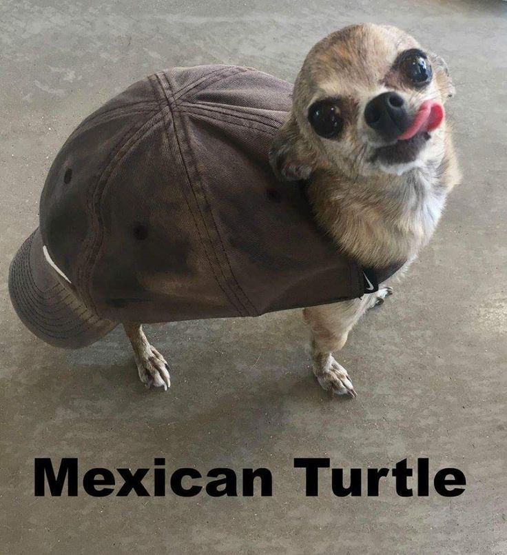
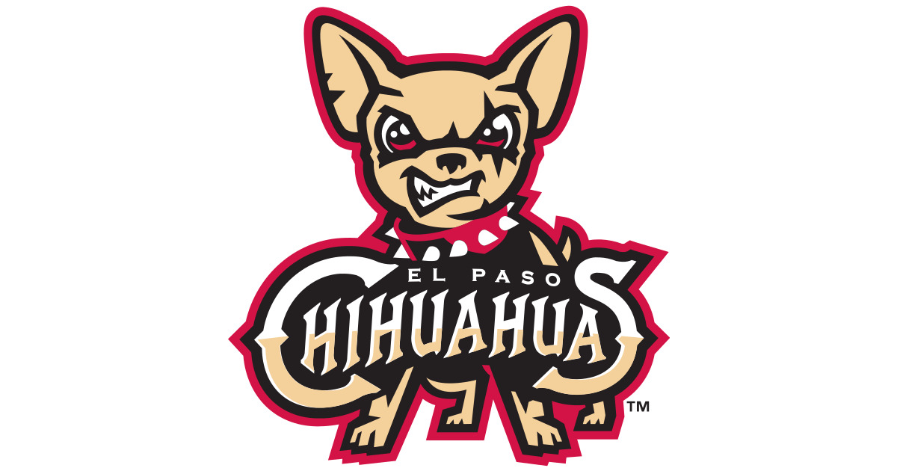

## About Me

I am a 1st year PhD student at Northwestern University.
Currently, I'm part of the [MAGICS lab](https://magics.cs.northwestern.edu/index.html) at Northwestern.

I mostly do theoretical machine learning.

*Big as the what?*

## News

- **[Dec. 2024]** I will be attending NeurIPS 2024.
- **[Sep. 2024]** Yes.
- **[Aug. 2024]** Will my paper get accepted by NeurIPS 2024?
- **[May. 2024]** Yes.
- **[Apr. 2024]** Will my papers get accepted by ICML 2024?
- **[Apr. 2024]** I will be attending ICLR 2024.
- **[Nov. 2023]** One paper is accepted to ICLR 2024.



## Timmy Turner

## Chihuahua (1)

## El Paso Chihuahua (Minor League Baseball)

